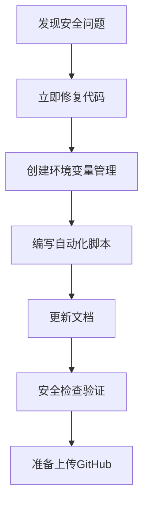

# NoteFlow 安全配置完整流程

本文档记录了NoteFlow项目从发现API密钥泄露到完全解决的完整流程，可作为其他项目的参考模板。

## 📋 流程概览



## 🚨 第一步：问题发现与评估

### 发现方式
使用 `grep` 命令搜索敏感信息：
```bash
# 搜索API密钥
grep -r "sk-" .

# 搜索webhook URL
grep -r "flomoapp.com" .
```

### 发现的问题
1. **高风险**：`backend/handwriting_recognizer.py` 中硬编码真实API密钥
2. **高风险**：同文件中硬编码真实flomo webhook URL
3. **中风险**：文档中包含真实密钥示例

### 风险评估
- 🔴 **立即风险**：密钥可能被滥用，产生费用
- 🔴 **数据风险**：笔记可能被恶意推送到flomo
- 🟡 **声誉风险**：开源项目安全性受质疑

## 🛠️ 第二步：立即修复代码

### 修改文件：`backend/handwriting_recognizer.py`

**修改前（危险）**：
```python
DASHSCOPE_API_KEY = os.getenv("DASHSCOPE_API_KEY", "sk-xxxxxxxxxxxxxxxxxxxxxxxxxxxxxxxx")
FLMO_WEBHOOK_URL = "https://flomoapp.com/iwh/xxxxxxxx/xxxxxxxxxxxxxxxxxxxxxxxxxxxxxxxx/"
```

**修改后（安全）**：
```python
# 配置与初始化 - 使用环境变量（安全）
DASHSCOPE_API_KEY = os.getenv("DASHSCOPE_API_KEY")
DASHSCOPE_BASE_URL = "https://dashscope.aliyuncs.com/compatible-mode/v1"

FLMO_WEBHOOK_URL = os.getenv("FLMO_WEBHOOK_URL")

# 验证必要的环境变量
if not DASHSCOPE_API_KEY:
    raise ValueError("DASHSCOPE_API_KEY environment variable is required")
if not FLMO_WEBHOOK_URL:
    raise ValueError("FLMO_WEBHOOK_URL environment variable is required")
```

### 关键改进
1. **移除默认值**：不再提供硬编码的fallback值
2. **添加验证**：启动时检查必要环境变量
3. **清晰注释**：标明安全配置的重要性

## 📁 第三步：环境变量管理

### 创建 `env.example` 模板
```bash
# 通义千问API配置
DASHSCOPE_API_KEY=sk-xxxxxxxxxxxxxxxxxxxxxxxxxxxxxxxx

# flomo webhook配置
FLMO_WEBHOOK_URL=https://flomoapp.com/iwh/xxxxxxxx/xxxxxxxxxxxxxxxxxxxxxxxxxxxxxxxx

# 开发环境API地址
VITE_API_BASE_URL=http://localhost:8000
```

### 创建 `.gitignore` 规则
```gitignore
# 环境变量文件 - 重要：不要提交真实的API密钥
.env
.env.local
.env.development.local
.env.test.local
.env.production.local

# API密钥相关文件
**/config/secrets.*
**/keys/
*secret*
*key*

# Python、Node.js、IDE等其他忽略规则...
```

### 设计原则
- **模板化**：提供完整的配置模板
- **示例化**：使用明显的占位符
- **文档化**：每个配置项都有注释说明

## 🤖 第四步：自动化脚本

### Linux/Mac 脚本：`setup.sh`
```bash
#!/bin/bash

echo "🚀 NoteFlow 项目环境设置向导"
echo "================================="

# 检查现有配置
if [ -f ".env" ]; then
    echo "⚠️  发现已存在的 .env 文件"
    read -p "是否要重新创建？(y/N): " -n 1 -r
    echo
    if [[ ! $REPLY =~ ^[Yy]$ ]]; then
        echo "保持现有配置，设置完成！"
        exit 0
    fi
fi

# 复制模板并引导配置
if [ -f "env.example" ]; then
    cp env.example .env
    echo "✅ 已创建 .env 文件"
else
    echo "❌ 未找到 env.example 模板文件"
    exit 1
fi

# 提供配置指导...
```

### Windows 脚本：`setup.bat`
```batch
@echo off
chcp 65001 > nul
echo 🚀 NoteFlow 项目环境设置向导
echo =================================

REM 检查现有配置
if exist ".env" (
    echo ⚠️  发现已存在的 .env 文件
    set /p "choice=是否要重新创建？(y/N): "
    if /i not "%choice%"=="y" (
        echo 保持现有配置，设置完成！
        pause
        exit /b 0
    )
)

REM 复制模板并引导配置...
```

### 脚本特点
- **跨平台**：支持Linux/Mac和Windows
- **交互式**：引导用户完成配置
- **智能化**：检测现有配置，避免覆盖
- **教育性**：提供安全提醒和最佳实践

## 📚 第五步：文档更新

### 更新主README
- 添加安全配置章节
- 提供快速开始指南
- 强调API密钥安全的重要性

### 创建专门的安全指南
- `docs/security_guide.md`：完整的安全配置指南
- 包含获取密钥的详细步骤
- 提供故障排除方案
- 记录最佳实践

### 更新部署文档
- 在所有部署方案中强调环境变量配置
- 提供云平台的密钥管理指南
- 添加安全检查清单

## 🔍 第六步：自动化安全检查

### 创建 `security_check.py` 脚本
```python
#!/usr/bin/env python3
"""
NoteFlow项目安全检查脚本
用于检测代码中可能存在的敏感信息泄露
"""

class SecurityChecker:
    def __init__(self, project_root):
        self.project_root = Path(project_root)
        self.issues = []
        
        # 敏感信息模式
        self.patterns = {
            'api_key': {
                'pattern': r'sk-[a-zA-Z0-9]{32,}',
                'description': '通义千问API密钥',
                'severity': 'HIGH'
            },
            'flomo_webhook': {
                'pattern': r'https://flomoapp\.com/iwh/[A-Za-z0-9]+/[a-f0-9]{32}',
                'description': 'flomo webhook完整URL',
                'severity': 'HIGH'
            }
        }
```

### 检查功能
1. **模式匹配**：检测各种敏感信息模式
2. **文件扫描**：递归扫描所有项目文件
3. **智能过滤**：排除示例和模板文件
4. **报告生成**：生成详细的安全报告

## ✅ 第七步：验证与测试

### 运行安全检查
```bash
cd NoteFlow
python security_check.py
```

### 期望输出
```
🔍 NoteFlow 安全检查工具
检查项目中是否存在敏感信息泄露...

📁 检查环境文件配置...
   ✅ 未发现 .env 文件
   ✅ 找到 env.example 模板文件

📄 检查 .gitignore 配置...
   ✅ .gitignore 配置正确

🔍 开始安全扫描...

============================================================
🛡️  NoteFlow 安全检查报告
============================================================
✅ 未发现安全问题！
项目可以安全地上传到GitHub。

============================================================
🎉 安全检查通过！项目可以安全上传到GitHub。

📋 上传前最后检查清单：
   ✅ 代码中无硬编码API密钥
   ✅ .gitignore 配置正确
   ✅ env.example 模板存在
   ✅ 安全扫描通过
```

## 🎯 第八步：最终检查清单

### 代码安全
- [ ] 移除所有硬编码的API密钥
- [ ] 移除所有硬编码的webhook URL
- [ ] 添加环境变量验证逻辑
- [ ] 更新所有相关注释

### 文件管理
- [ ] 创建 `env.example` 模板
- [ ] 配置完整的 `.gitignore`
- [ ] 确保 `.env` 文件不存在（或在gitignore中）
- [ ] 验证模板文件的完整性

### 自动化工具
- [ ] 创建跨平台设置脚本
- [ ] 实现安全检查脚本
- [ ] 测试所有自动化工具
- [ ] 验证脚本的错误处理

### 文档完善
- [ ] 更新主README文档
- [ ] 创建详细的安全指南
- [ ] 更新部署文档
- [ ] 添加故障排除指南

### 验证测试
- [ ] 运行安全检查脚本
- [ ] 测试环境设置脚本
- [ ] 验证新开发者流程
- [ ] 确认所有链接有效

## 🚀 第九步：开发者体验优化

### 新开发者流程
1. **克隆项目**：`git clone https://github.com/username/NoteFlow.git`
2. **自动设置**：运行 `./setup.sh` 或 `setup.bat`
3. **配置密钥**：按提示填入真实API密钥
4. **验证配置**：运行项目确认一切正常

### 持续安全
- 定期运行安全检查脚本
- 监控依赖库的安全更新
- 定期轮换API密钥
- 审查新代码的安全性

## 📊 流程效果评估

### 安全性提升
- ✅ **消除硬编码风险**：所有敏感信息环境变量化
- ✅ **防止意外提交**：完善的gitignore规则
- ✅ **自动化检测**：持续的安全扫描
- ✅ **开发者教育**：详细的安全指南

### 开发体验改善
- ✅ **一键设置**：自动化环境配置
- ✅ **清晰指导**：详细的配置文档
- ✅ **错误预防**：启动时的环境验证
- ✅ **跨平台支持**：Windows和Unix系统兼容

### 项目质量提升
- ✅ **专业形象**：规范的安全实践
- ✅ **开源友好**：安全的代码分享
- ✅ **维护便利**：自动化的安全检查
- ✅ **扩展性好**：可复用的安全框架

## 🔄 后续维护建议

### 定期检查（每月）
- 运行安全检查脚本
- 检查依赖库更新
- 验证API密钥有效性
- 审查访问日志

### 版本更新时
- 更新安全检查规则
- 测试自动化脚本
- 更新文档内容
- 验证新功能的安全性

### 团队协作
- 培训新成员安全意识
- 建立代码审查流程
- 制定安全事件响应计划
- 分享最佳实践经验

---

## 📚 相关资源

- [OWASP安全编码实践](https://owasp.org/www-project-secure-coding-practices-quick-reference-guide/)
- [GitHub安全最佳实践](https://docs.github.com/en/code-security)
- [环境变量管理指南](https://12factor.net/config)
- [API密钥安全指南](https://cloud.google.com/docs/authentication/api-keys)

**这个流程确保了项目的安全性，同时保持了良好的开发体验！** 🛡️✨ 