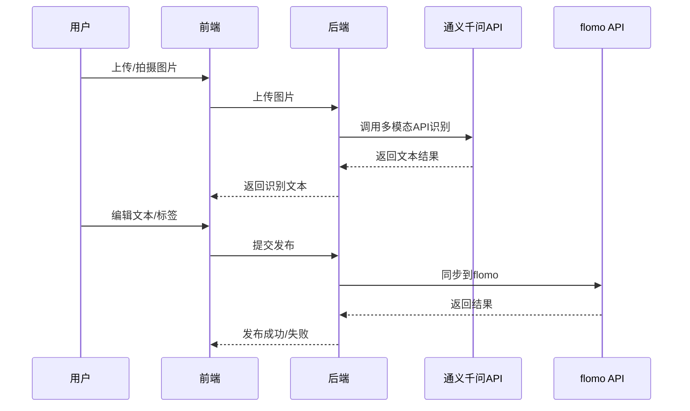

# 系统架构设计

## 1. 总体架构

- 前端：移动端自适应网页，负责图片上传、文本编辑、标签管理、交互体验。
- 后端：Python（Flask/FastAPI），负责图片接收、调用通义千问API、文本处理、与flomo API对接。
- 第三方服务：
  - 通义千问多模态大模型API（OCR+文本识别）
  - flomo API（笔记同步）

## 2. 技术选型

- 前端：React + Antd Mobile（或Vant），支持移动端自适应
- 后端：Python 3.9+，Flask或FastAPI
- 存储：本地临时存储/云存储（可扩展）

## 3. 关键流程

1. 用户上传/拍摄图片
2. 前端上传图片到后端
3. 后端图片处理，生成图片URL
4. Prompt管理模块生成Prompt
5. 后端调用通义千问API识别手写文本
6. 结果解析，返回文本或兜底提示
7. 若识别成功，后端自动调用标签生成模块，返回标签
8. 前端支持文本编辑与标签管理
9. 用户确认后，后端拼接文本、标签、图片，调用flomo API同步笔记

## 4. 交互流程图

